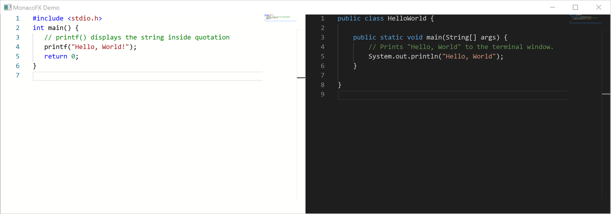

# MonacoFX

JavaFX editor node based on the powerful Monaco editor that drives VSCode

## How To Build The Project

### 1. Dependencies

- JDK >= 11 (tested with JDK 13)
- Internet Connection (other dependencies will be downloaded automatically)
- Optional: IDE with [Gradle](http://www.gradle.org/) support

### 2. Building

#### IDE

To build the project from an IDE do the following:

- open the  [Gradle](http://www.gradle.org/) project
- call the `assemble` Gradle task to build the project

#### Command Line

Building the project from the command line is also possible.

Navigate to the project folder and call the `assemble` [Gradle](http://www.gradle.org/)
task to build the project.

##### Bash (Linux/OS X/Cygwin/other Unix-like OS)

    cd Path/To/MonacoFX
    ./gradlew assemble
    
##### Windows (CMD)

    cd Path\To\MonacoFX
    gradlew assemble

### 3. Running the sample App

#### IDE

To run the project from an IDE do the following:

- open the  [Gradle](http://www.gradle.org/) project
- call the `run` Gradle task to run the project

#### Command Line

Running the project from the command line is also possible.

Navigate to the project folder and call the `run` [Gradle](http://www.gradle.org/)
task to run the project.

##### Bash (Linux/OS X/Cygwin/other Unix-like OS)

    cd Path/To/MonacoFX
    ./gradlew run
    
##### Windows (CMD)

    cd Path\To\MonacoFX
    gradlew run

